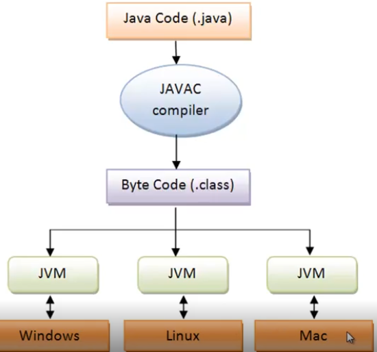

# JAVA
learn java
# what is java?
java is a simple langauage

High-level-language ---> assembly language ---> machin language<0,1> ---> HardWare

# list of the java
1) serverSide --> JAVA Standard/Enterprise Edition.(JAVA SE,EE)
2) java Android.
3) Electronic devices --> java Micro Edition.
4) java Card

# JDK
java Develop ket ==> that allow us to compile the java code
## JRE
a part bit onJDK that just run JAVA compile
# JVM (java virtual machine)
all code jave run by this.

1) jvm --> os --> hardware
2) java.code.java ---> JAVAC(java compiler) ---> Byte Code (.class) (interpreted)---> JAVM

* c++ run on os directly
* c# run on .net
# mean
1) platform Independence --> write a programmer that run in all envirement.
2) cross-platform 
3) portable --> transform a programing and run to a lot os.
4) Architecture Neutral
5) Write Once Run Anywhere
